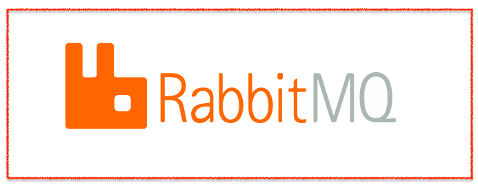
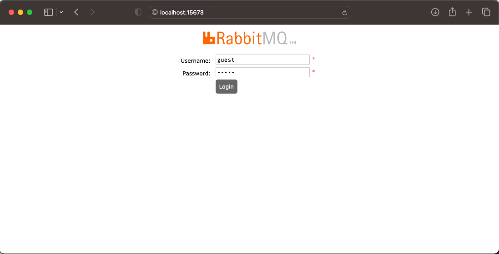
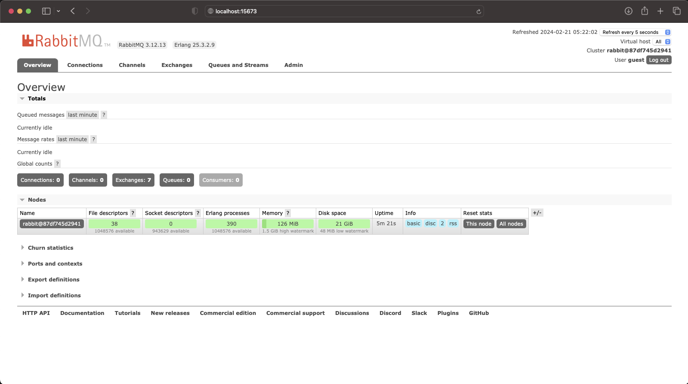

    

# Docker Compose Rabbit MQ
---

### Jalankan command pada Terminal :

    ❯ docker-compose up -d

### Open Browser
    URL http://localhost:15673

        - user : guest
        - password : guest

---

    

    

