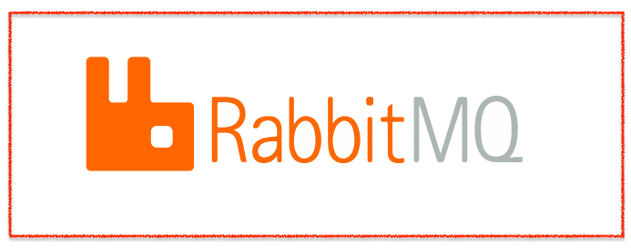

    

   - <a href="./001-docker-compose-rabbitmq-standard">Link to view entire docker-compose-rabbitmq-standard</a>

   - <a href="./expressjs-connected-rabbitmq-producer-consumer">Link to view entire expressjs-connected-rabbitmq-producer-consumer</a>

