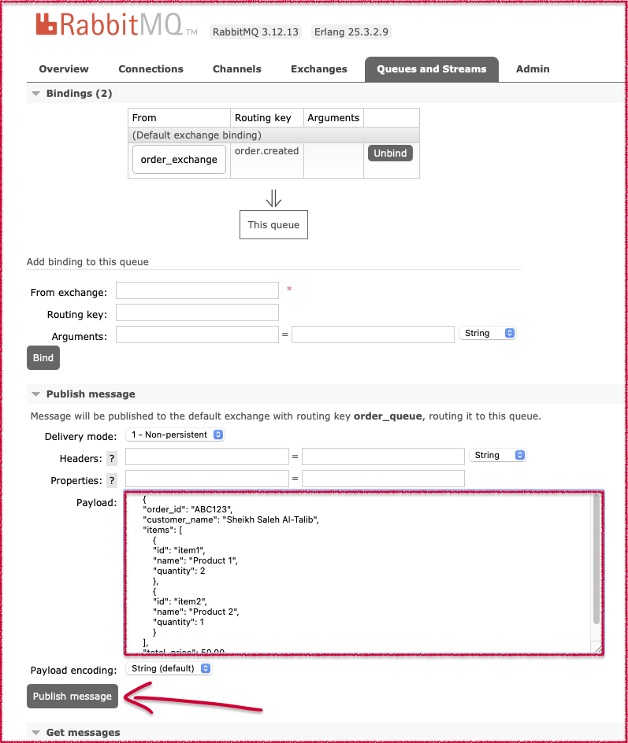
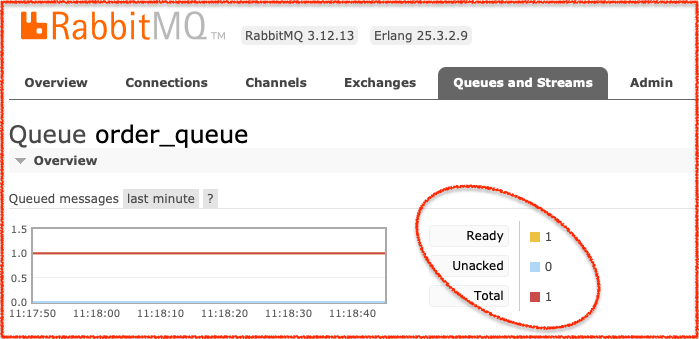
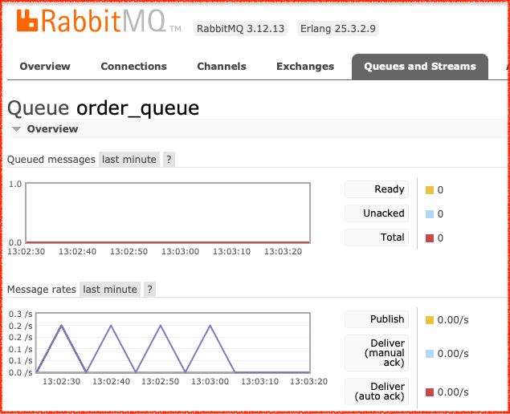
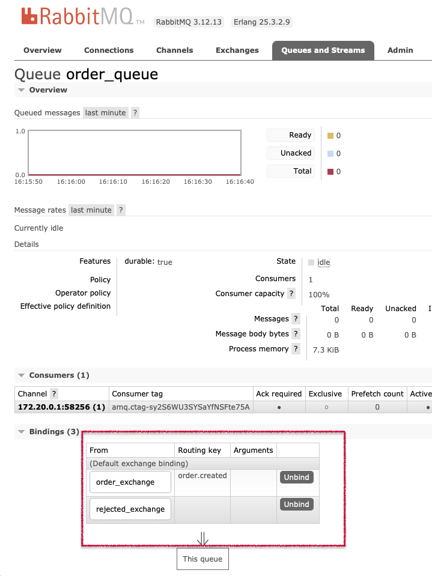
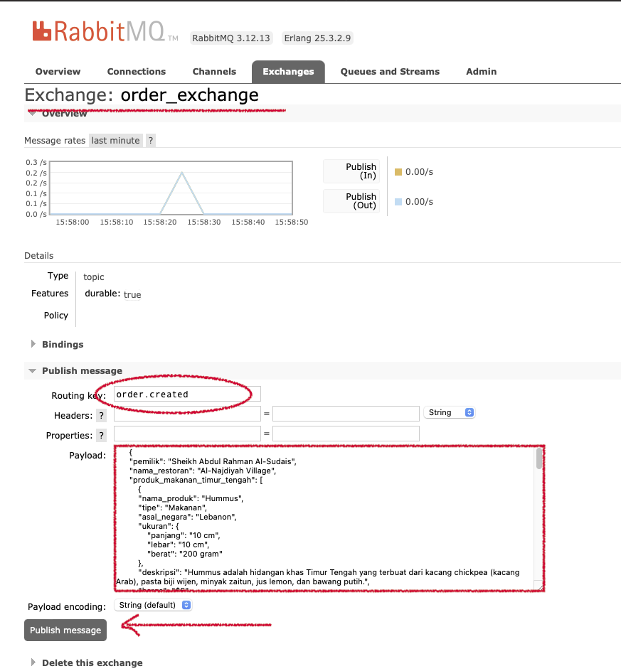
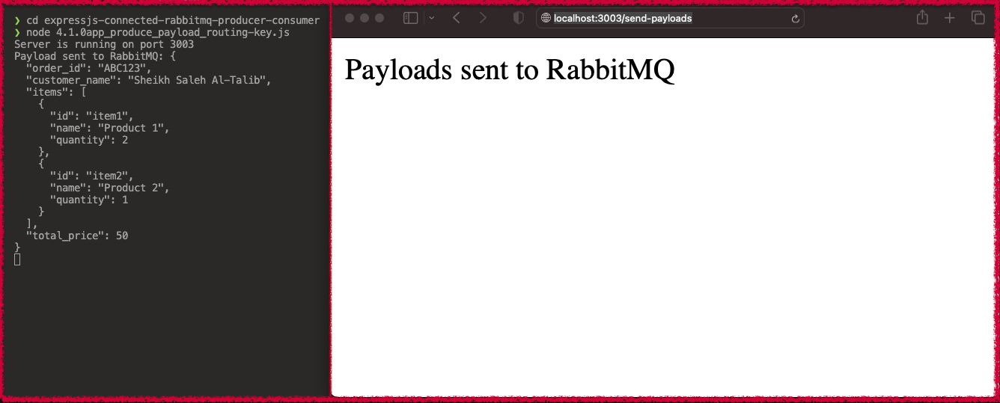
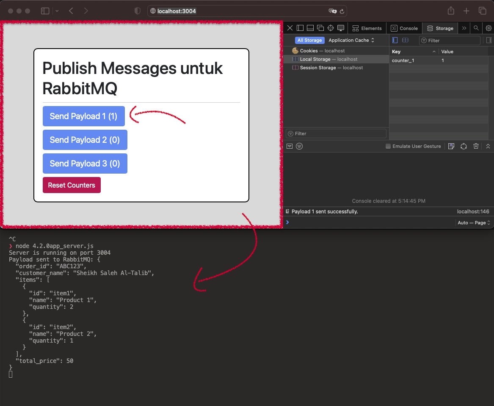
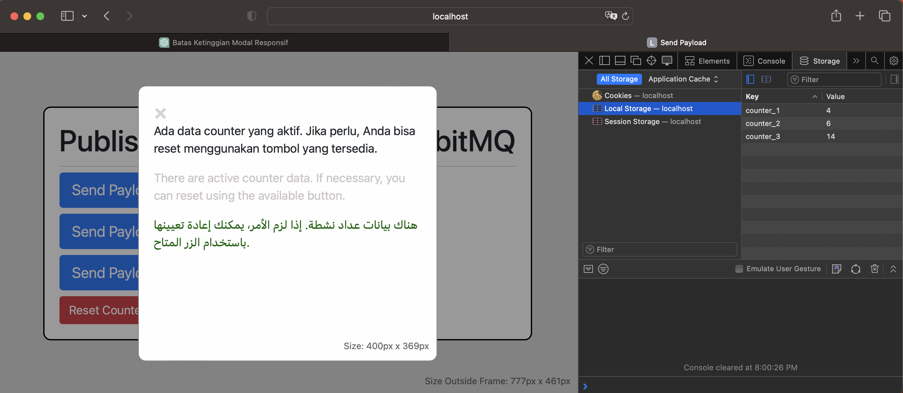
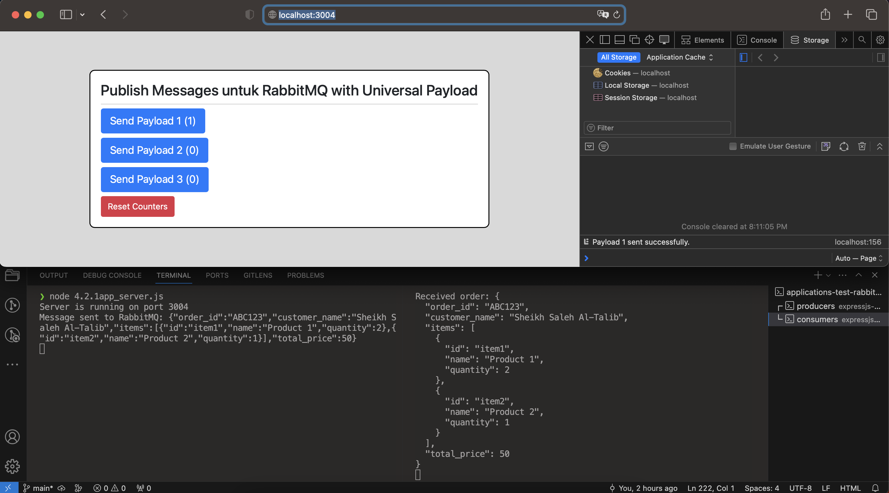
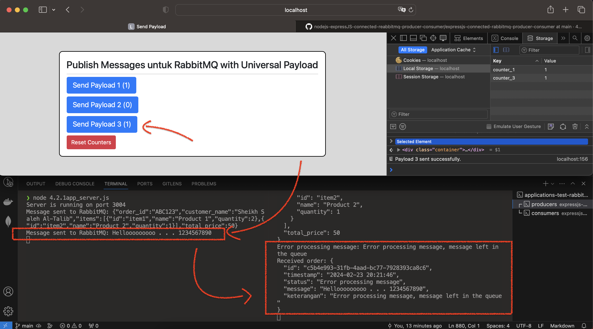

# nodejs sederhana dengan framework expressjs #

---

instalasi expressjs:

    ❯ npm install express

pastikan sebelumnya telah menginstall paket diperlukan yaitu :

- amqplib, uuid, moment-timezone

    - cara install

            ❯ npm install amqplib

            ❯ npm install uuid

            ❯ npm install moment-timezone

    - tampilkan list paket
    
            ❯ npm list
    
                ├── amqplib@0.10.3

                ├── express@4.18.0

                ├── moment-timezone@0.5.45

                └── uuid@9.0.1

periksa file json dan buat file js secara manual serta isinya.

- package.json

- (file .js berdasarkan masing-masing projects)

---

### { Container RabbitMQ }

rabbitmq console management = URL http://localhost:15673

Untuk akses :  
- user = guest
- password = guest

---

jalankan (command) :

    ❯ node <file .js berdasarkan masing-masing projects>
        op:
        Server running on port <port>

---

### sample payload (json format):

    

- sample 1

            {
            "order_id": "ABC123",
            "customer_name": "Sheikh Saleh Al-Talib",
            "items": [
                {
                "id": "item1",
                "name": "Product 1",
                "quantity": 2
                },
                {
                "id": "item2",
                "name": "Product 2",
                "quantity": 1
                }
            ],
            "total_price": 50.00
            }

- sample 2 

            {
            "pemilik": "Sheikh Abdul Rahman Al-Sudais",
            "nama_restoran": "Al-Najdiyah Village",
            "produk_makanan_timur_tengah": [
                {
                "nama_produk": "Hummus",
                "tipe": "Makanan",
                "asal_negara": "Lebanon",
                "ukuran": {
                    "panjang": "10 cm",
                    "lebar": "10 cm",
                    "berat": "200 gram"
                },
                "deskripsi": "Hummus adalah hidangan khas Timur Tengah yang terbuat dari kacang chickpea (kacang Arab), pasta biji wijen, minyak zaitun, jus lemon, dan bawang putih.",
                "harga": "$5",
                "bahan_bahan": "Vegan, tanpa gluten"
                },
                {
                "nama_produk": "Falafel",
                "tipe": "Makanan",
                "asal_negara": "Mesir",
                "ukuran": {
                    "panjang": "5 cm",
                    "lebar": "5 cm",
                    "berat": "50 gram"
                },
                "deskripsi": "Falafel adalah bola-bola kecil yang terbuat dari kacang-kacangan tumbuk dan rempah-rempah yang kemudian digoreng. Biasanya disajikan dengan roti pita, sayuran, dan saus tahini.",
                "harga": "$3",
                "bahan_bahan": "Vegan, tanpa gluten"
                },
                {
                "nama_produk": "Baklava",
                "tipe": "Kue",
                "asal_negara": "Turki",
                "ukuran": {
                    "panjang": "5 cm",
                    "lebar": "5 cm",
                    "berat": "50 gram"
                },
                "deskripsi": "Baklava adalah sejenis kue manis yang terbuat dari lapisan tipis pastry yang diisi dengan kacang atau biji-bijian, dicelup dalam sirup madu atau gula.",
                "harga": "$2",
                "bahan_bahan": "Mengandung kacang"
                },
                {
                "nama_produk": "Shawarma",
                "tipe": "Makanan",
                "asal_negara": "Yaman",
                "ukuran": {
                    "panjang": "15 cm",
                    "lebar": "10 cm",
                    "berat": "150 gram"
                },
                "deskripsi": "Shawarma adalah hidangan daging yang dipanggang secara vertikal dan diiris tipis. Biasanya disajikan dengan roti, sayuran, dan saus.",
                "harga": "$6",
                "bahan_bahan": "Daging sapi, ayam, atau kambing"
                },
                {
                "nama_produk": "Baba Ghanoush",
                "tipe": "Makanan",
                "asal_negara": "Suriah",
                "ukuran": {
                    "panjang": "10 cm",
                    "lebar": "10 cm",
                    "berat": "200 gram"
                },
                "deskripsi": "Baba Ghanoush adalah hidangan dari Timur Tengah yang terbuat dari bakteri panggang yang dihancurkan, dicampur dengan tahini, minyak zaitun, bawang putih, dan rempah-rempah.",
                "harga": "$5",
                "bahan_bahan": "Vegan, tanpa gluten"
                },
                {
                "nama_produk": "Kebab",
                "tipe": "Makanan",
                "asal_negara": "Iran",
                "ukuran": {
                    "panjang": "15 cm",
                    "lebar": "5 cm",
                    "berat": "100 gram"
                },
                "deskripsi": "Kebab adalah hidangan daging yang dipanggang atau dipanggang. Daging dipotong menjadi potongan-potongan kecil atau digiling, disusun pada tusukan, dan dipanggang atau dipanggang.",
                "harga": "$4",
                "bahan_bahan": "Daging sapi, ayam, atau kambing"
                }
            ]
            }

- sample 3

            {
            "nama_toko": "Al-Sudais Motors",
            "pemilik": "Abdul Rahman Al-Sudais",
            "tahun_berdiri": "1995",
            "nomor_ijin_usaha": "1234567890",
            "produk_supercar": [
                {
                "nama": "Lamborghini Aventador",
                "tipe": "Coupe",
                "cc": "6498",
                "bahan_bakar": "Bensin",
                "varian_warna": ["Merah", "Hitam", "Putih"],
                "negara_asal": "Italia",
                "deskripsi": "Lamborghini Aventador adalah supercar berperforma tinggi yang diproduksi oleh produsen mobil Italia, Lamborghini. Dilengkapi dengan mesin V12 yang kuat dan desain aerodinamis yang futuristik.",
                "harga": "$500,000"
                },
                {
                "nama": "Ferrari 488 Pista",
                "tipe": "Coupe",
                "cc": "3902",
                "bahan_bakar": "Bensin",
                "varian_warna": ["Merah", "Kuning", "Biru"],
                "negara_asal": "Italia",
                "deskripsi": "Ferrari 488 Pista adalah supercar berperforma tinggi yang dirancang untuk lintasan balap. Dilengkapi dengan mesin V8 twin-turbo yang kuat dan teknologi balap terdepan dari Ferrari.",
                "harga": "$350,000"
                },
                {
                "nama": "McLaren 720S",
                "tipe": "Coupe",
                "cc": "3994",
                "bahan_bakar": "Bensin",
                "varian_warna": ["Hitam", "Silver", "Orange"],
                "negara_asal": "Inggris",
                "deskripsi": "McLaren 720S adalah supercar dengan desain futuristik dan performa luar biasa. Ditenagai oleh mesin V8 twin-turbo yang kuat, 720S menawarkan kombinasi sempurna antara kecepatan dan kemewahan.",
                "harga": "$300,000"
                },
                {
                "nama": "Bugatti Chiron",
                "tipe": "Coupe",
                "cc": "7993",
                "bahan_bakar": "Bensin",
                "varian_warna": ["Hitam", "Biru", "Silver"],
                "negara_asal": "Prancis",
                "deskripsi": "Bugatti Chiron adalah salah satu supercar paling canggih di dunia dengan kecepatan tertinggi yang mencapai lebih dari 400 km/jam. Dilengkapi dengan mesin W16 quad-turbo yang sangat kuat dan teknologi terkemuka dari Bugatti.",
                "harga": "$3,000,000"
                },
                {
                "nama": "Pagani Huayra",
                "tipe": "Coupe",
                "cc": "5980",
                "bahan_bakar": "Bensin",
                "varian_warna": ["Silver", "Abu-abu", "Merah"],
                "negara_asal": "Italia",
                "deskripsi": "Pagani Huayra adalah supercar yang sangat eksklusif dengan desain yang memukau dan performa yang luar biasa. Ditenagai oleh mesin V12 twin-turbo kustom yang dirancang khusus oleh Mercedes-AMG.",
                "harga": "$2,800,000"
                }
            ]
            }

---

### Jalankan project secara paralel

- Project Rabbitmq untuk <b>producer</b> 

        ❯ node 1.app_producer.js

- Project Rabbitmq untuk <b>consumer</b> 

        ❯ node 2.<major>.<version>app_consumer_<note>.js

- Project Rabbitmq untuk clear_unacked (optional dijalankan)

        ❯ node 3.app_clear_unacked.js

---

### Pengujian aplikasi 

- Initialize

        ##  - - - - - - - - - Terminal Command - - - - - - - - -
        ❯ node 1.app_producer.js

            Service Producer berjalan pada port 3000
            Koneksi RabbitMQ berhasil dibuat

- Skenario 1 

    subject : Penolakan Pesan untuk Format JSON Tidak Valid dengan Error Detail.

        ##  - - - - - - - - - Terminal Command - - - - - - - - - 
        ❯ node 2.1.0app_consumer_old.js

            # Hasil jika publish message pada RabbitMQ dengan format JSON valid

                Consumer service running on port 3001
                Received message:       {
                    "order_id": "ABC123",
                    "customer_name": "Sheikh Saleh Al-Talib",
                    "items": [
                        {
                        "id": "item1",
                        "name": "Product 1",
                        "quantity": 2
                        },
                        {
                        "id": "item2",
                        "name": "Product 2",
                        "quantity": 1
                        }
                    ],
                    "total_price": 50.00
                    }
                Received order: {
                "order_id": "ABC123",
                "customer_name": "Sheikh Saleh Al-Talib",
                "items": [
                    {
                    "id": "item1",
                    "name": "Product 1",
                    "quantity": 2
                    },
                    {
                    "id": "item2",
                    "name": "Product 2",
                    "quantity": 1
                    }
                ],
                "total_price": 50
                }         

            # Hasil jika publish message pada RabbitMQ bukan format JSON valid

                Received message: Hellooooooo . . .
                Error parsing message: SyntaxError: Unexpected token H in JSON at position 0
                    at JSON.parse (<anonymous>)
                . . .            

    notes : 

    perhatikan pada code berikut

        . . .
            } catch (error) {
                console.error('Error parsing message:', error);
                // Reject or handle the message in case of parsing error
                channel.reject(message, false); // Reject the message, false means don't requeue
            }
        . . .        

    sehingga message yang diterima dan error (karena adanya validasi format json) akan ditolak dan dikeluarkan dari antrian message (tidak masuk ke unacked).

---

- Skenario 2

    subject : Aplikasi Keluar untuk Format JSON Tidak Valid dengan Error Detail.

        ##  - - - - - - - - - Terminal Command - - - - - - - - - 

        ❯ node 2.1.1app_consumer_new1.js

            # Hasil jika publish message pada RabbitMQ dengan format JSON valid

                Consumer service running on port 3001
                Received order: {
                "order_id": "ABC123",
                "customer_name": "Sheikh Saleh Al-Talib",
                "items": [
                    {
                    "id": "item1",
                    "name": "Product 1",
                    "quantity": 2
                    },
                    {
                    "id": "item2",
                    "name": "Product 2",
                    "quantity": 1
                    }
                ],
                "total_price": 50
                }

            # Hasil jika publish message pada RabbitMQ bukan format JSON valid

                node:events:504
                    throw er; // Unhandled 'error' event
                    ^

                SyntaxError: Unexpected token H in JSON at position 0
                    at JSON.parse (<anonymous>)
                . . .
                [application exited]

    notes : 

    perhatikan pada code berikut

        . . .
            channel.consume(rabbitMQConfig.queue, (message) => {

                const order = JSON.parse(message.content.toString());
                console.log('Received order:', order);
                // Lakukan proses sesuai kebutuhan

                // Konfirmasi pesan telah dikonsumsi
                channel.ack(message);

            });
        } catch (error) {

            console.error('Error consuming message:', error);

        }
        . . .        

    sehingga message yang diterima dan error (karena adanya validasi format json) kemudian aplikasi langsung keluar sehingga message otomatis ke unacked.
    Ini adalah hal yang buruk karena ketika message di terima tidak ada penanganan error jika terjadi kesalahan/error pada tahap ini.

    

    Jalankan aplikasi clear unacked ketika aplikasi consumer telah berhenti (exited) untuk membantu menghapus messages yang masuk pada antrian unacked

        ❯ node 3.app_clear_unacked.js

            Server running on port 3002
            [2024-02-22 13:14:41] No unacked messages found.
            [2024-02-22 13:14:51] No unacked messages found.
            [2024-02-22 13:15:01] No unacked messages found.
            [2024-02-22 13:15:01] Temporary suspension of unacked message checking process.
            [2024-02-22 13:15:56] Resuming unacked message checking process.
            [2024-02-22 13:16:01] No unacked messages found.
            [2024-02-22 13:16:11] No unacked messages found.
            [2024-02-22 13:16:21] No unacked messages found.
            [2024-02-22 13:16:21] Temporary suspension of unacked message checking process.

    

---

- Skenario 3

    subject : Penolakan Pesan untuk Format JSON Tidak Valid dengan Spesifikasi Error.

        ##  - - - - - - - - - Terminal Command - - - - - - - - - 

        ❯ node 2.1.2app_consumer_new2.js

            # Hasil jika publish message pada RabbitMQ dengan format JSON valid

                Consumer service running on port 3001
                Received message:       {
                    "order_id": "ABC123",
                    "customer_name": "Sheikh Saleh Al-Talib",
                    "items": [
                        {
                        "id": "item1",
                        "name": "Product 1",
                        "quantity": 2
                        },
                        {
                        "id": "item2",
                        "name": "Product 2",
                        "quantity": 1
                        }
                    ],
                    "total_price": 50.00
                    }
                Received order: {
                "order_id": "ABC123",
                "customer_name": "Sheikh Saleh Al-Talib",
                "items": [
                    {
                    "id": "item1",
                    "name": "Product 1",
                    "quantity": 2
                    },
                    {
                    "id": "item2",
                    "name": "Product 2",
                    "quantity": 1
                    }
                ],
                "total_price": 50
                }

            # Hasil jika publish message pada RabbitMQ bukan format JSON valid

                Invalid JSON format, message left in the queue
                Invalid JSON format, message left in the queue
                Invalid JSON format, message left in the queue
                Invalid JSON format, message left in the queue
                Invalid JSON format, message left in the queue
                Invalid JSON format, message left in the queue
                Invalid JSON format, message left in the queue
                Invalid JSON format, message left in the queue
                Invalid JSON format, message left in the queue
                Invalid JSON format, message left in the queue
                Invalid JSON format, message left in the queue
                . . .

    notes : 

    perhatikan pada code berikut

            . . .
            } catch (error) {

                console.error('Invalid JSON format, message left in the queue');
                // Requeue the message if it is not valid JSON format

                await channel.reject(message, true); // true means requeue

            }
            . . .        

    - `channel.reject(message, true)`

        Pesan yang ditolak akan dikembalikan ke antrian, sehingga dapat diambil kembali untuk diproses kemudian.
 
    - `channel.reject(message, false)`

        Pesan yang ditolak akan dihapus dari antrian dan tidak akan dikembalikan. Artinya, pesan tersebut akan hilang dari antrian dan tidak akan diproses lagi (unacked).

    #### End.
    Hentikan aplikasi consumer, kemudian jalankan aplikasi clear unacked untuk membantu menghapus messages yang masuk pada antrian unacked

        ❯ node 3.app_clear_unacked.js

            Server running on port 3002
            [2024-02-22 13:38:25] Clearing message from unacked: Helloooo . . . 123
            [2024-02-22 13:38:25] All unacked messages cleared.

    Metode pada project ini (2.1.2app_consumer_new2.js) buruk untuk diterapkan sehingga tidak direkomendasikan pemakaiannya.
---

- Skenario 4

    subject : Metode Event-Driven dan Penanganan Kesalahan dengan Spesifikasi Error, Payload Penolakkan di publish Melalui Exchange Terhubung. [RECOMMENDED]

        ##  - - - - - - - - - Terminal Command - - - - - - - - - 

        ❯ node 2.2.0app_consumer_new3_event-driven.js

            # Hasil jika publish message pada RabbitMQ dengan format JSON valid

                Consumer service running on port 3001
                Consumer setup completed.

                Valid JSON format, ready to be consumed.
                Received order: {
                "nama_toko": "Al-Sudais Motors",
                "pemilik": "Abdul Rahman Al-Sudais",
                "tahun_berdiri": "1995",
                "nomor_ijin_usaha": "1234567890",
                "produk_supercar": [
                    {
                    "nama": "Lamborghini Aventador",
                    "tipe": "Coupe",
                    "cc": "6498",
                    "bahan_bakar": "Bensin",
                    "varian_warna": [
                        "Merah",
                        "Hitam",
                        "Putih"
                    ],
                    "negara_asal": "Italia",
                    "deskripsi": "Lamborghini Aventador adalah supercar berperforma tinggi yang diproduksi oleh produsen mobil Italia, Lamborghini. Dilengkapi dengan mesin V12 yang kuat dan desain aerodinamis yang futuristik.",
                    "harga": "$500,000"
                    },
                    {
                    "nama": "Ferrari 488 Pista",
                    "tipe": "Coupe",
                    "cc": "3902",
                    "bahan_bakar": "Bensin",
                    "varian_warna": [
                        "Merah",
                        "Kuning",
                        "Biru"
                    ],
                    "negara_asal": "Italia",
                    "deskripsi": "Ferrari 488 Pista adalah supercar berperforma tinggi yang dirancang untuk lintasan balap. Dilengkapi dengan mesin V8 twin-turbo yang kuat dan teknologi balap terdepan dari Ferrari.",
                    "harga": "$350,000"
                    },
                    {
                    "nama": "McLaren 720S",
                    "tipe": "Coupe",
                    "cc": "3994",
                    "bahan_bakar": "Bensin",
                    "varian_warna": [
                        "Hitam",
                        "Silver",
                        "Orange"
                    ],
                    "negara_asal": "Inggris",
                    "deskripsi": "McLaren 720S adalah supercar dengan desain futuristik dan performa luar biasa. Ditenagai oleh mesin V8 twin-turbo yang kuat, 720S menawarkan kombinasi sempurna antara kecepatan dan kemewahan.",
                    "harga": "$300,000"
                    },
                    {
                    "nama": "Bugatti Chiron",
                    "tipe": "Coupe",
                    "cc": "7993",
                    "bahan_bakar": "Bensin",
                    "varian_warna": [
                        "Hitam",
                        "Biru",
                        "Silver"
                    ],
                    "negara_asal": "Prancis",
                    "deskripsi": "Bugatti Chiron adalah salah satu supercar paling canggih di dunia dengan kecepatan tertinggi yang mencapai lebih dari 400 km/jam. Dilengkapi dengan mesin W16 quad-turbo yang sangat kuat dan teknologi terkemuka dari Bugatti.",
                    "harga": "$3,000,000"
                    },
                    {
                    "nama": "Pagani Huayra",
                    "tipe": "Coupe",
                    "cc": "5980",
                    "bahan_bakar": "Bensin",
                    "varian_warna": [
                        "Silver",
                        "Abu-abu",
                        "Merah"
                    ],
                    "negara_asal": "Italia",
                    "deskripsi": "Pagani Huayra adalah supercar yang sangat eksklusif dengan desain yang memukau dan performa yang luar biasa. Ditenagai oleh mesin V12 twin-turbo kustom yang dirancang khusus oleh Mercedes-AMG.",
                    "harga": "$2,800,000"
                    }
                ]
                }

            # Hasil jika publish message pada RabbitMQ bukan format JSON valid

                Invalid JSON format, message left in the queue
                Received order: {
                "id": "be9d1df8-0d5b-4a36-89b3-f87862fb33a1",
                "timestamp": "2024-02-22 13:55:48",
                "status": "Invalid JSON format",
                "message": "Hellooo . .  123. ",
                "keterangan": "Pesan gagal, tanpa format JSON terkategori unacked message jika ditolak kembali masuk antrian."
                }            

    notes : 

    Penerapan metode event-driven terdapat pada fungsi `channel.consume()`, di mana akan mendifinisikan sebuah fungsi yang akan dijalankan setiap kali pesan baru diterima dari antrian rabbitmq. Fungsi ini akan dijalankan secara otomatis setiap kali ada pesan yang masuk ke antrian, tanpa perlu melakukan polling atau pemanggilan berulang

    Juga pada code di atas setiap di dapatkan message yang di consume bermasalah atau error ( validasi format JSON ), maka message akan dikonversikan atau di tolak ke exchange baru. Kemudian hasil payload penolakkan tersebut di publish dan di consume ulang melalui exchange yang telah terhubung.

---

- Skenario 5

    subject : Metode Event-Driven, Routing-Key ,dan Penanganan Kesalahan dengan Spesifikasi Error, Payload Penolakkan di publish Melalui Exchange Terhubung. [RECOMMENDED]

    Setelah 2.4.0app_consumer_by_routingKey_event-driven.js dijalankan, pastikan queue bindings ini terbentuk secara auto pada order_queue.

    

    

        ##  - - - - - - - - - Terminal Command - - - - - - - - - 

        ❯ node 2.4.0app_consumer_by_routingKey_event-driven.js

            # Hasil jika publish message pada RabbitMQ dengan format JSON valid

                Consumer service running on port 3001
                Waiting for messages...
                Received order: {
                "pemilik": "Sheikh Abdul Rahman Al-Sudais",
                "nama_restoran": "Al-Najdiyah Village",
                "produk_makanan_timur_tengah": [
                    {
                    "nama_produk": "Hummus",
                    "tipe": "Makanan",
                    "asal_negara": "Lebanon",
                    "ukuran": {
                        "panjang": "10 cm",
                        "lebar": "10 cm",
                        "berat": "200 gram"
                    },
                    "deskripsi": "Hummus adalah hidangan khas Timur Tengah yang terbuat dari kacang chickpea (kacang Arab), pasta biji wijen, minyak zaitun, jus lemon, dan bawang putih.",
                    "harga": "$5",
                    "bahan_bahan": "Vegan, tanpa gluten"
                    },
                    {
                    "nama_produk": "Falafel",
                    "tipe": "Makanan",
                    "asal_negara": "Mesir",
                    "ukuran": {
                        "panjang": "5 cm",
                        "lebar": "5 cm",
                        "berat": "50 gram"
                    },
                    "deskripsi": "Falafel adalah bola-bola kecil yang terbuat dari kacang-kacangan tumbuk dan rempah-rempah yang kemudian digoreng. Biasanya disajikan dengan roti pita, sayuran, dan saus tahini.",
                    "harga": "$3",
                    "bahan_bahan": "Vegan, tanpa gluten"
                    },
                    {
                    "nama_produk": "Baklava",
                    "tipe": "Kue",
                    "asal_negara": "Turki",
                    "ukuran": {
                        "panjang": "5 cm",
                        "lebar": "5 cm",
                        "berat": "50 gram"
                    },
                    "deskripsi": "Baklava adalah sejenis kue manis yang terbuat dari lapisan tipis pastry yang diisi dengan kacang atau biji-bijian, dicelup dalam sirup madu atau gula.",
                    "harga": "$2",
                    "bahan_bahan": "Mengandung kacang"
                    },
                    {
                    "nama_produk": "Shawarma",
                    "tipe": "Makanan",
                    "asal_negara": "Yaman",
                    "ukuran": {
                        "panjang": "15 cm",
                        "lebar": "10 cm",
                        "berat": "150 gram"
                    },
                    "deskripsi": "Shawarma adalah hidangan daging yang dipanggang secara vertikal dan diiris tipis. Biasanya disajikan dengan roti, sayuran, dan saus.",
                    "harga": "$6",
                    "bahan_bahan": "Daging sapi, ayam, atau kambing"
                    },
                    {
                    "nama_produk": "Baba Ghanoush",
                    "tipe": "Makanan",
                    "asal_negara": "Suriah",
                    "ukuran": {
                        "panjang": "10 cm",
                        "lebar": "10 cm",
                        "berat": "200 gram"
                    },
                    "deskripsi": "Baba Ghanoush adalah hidangan dari Timur Tengah yang terbuat dari bakteri panggang yang dihancurkan, dicampur dengan tahini, minyak zaitun, bawang putih, dan rempah-rempah.",
                    "harga": "$5",
                    "bahan_bahan": "Vegan, tanpa gluten"
                    },
                    {
                    "nama_produk": "Kebab",
                    "tipe": "Makanan",
                    "asal_negara": "Iran",
                    "ukuran": {
                        "panjang": "15 cm",
                        "lebar": "5 cm",
                        "berat": "100 gram"
                    },
                    "deskripsi": "Kebab adalah hidangan daging yang dipanggang atau dipanggang. Daging dipotong menjadi potongan-potongan kecil atau digiling, disusun pada tusukan, dan dipanggang atau dipanggang.",
                    "harga": "$4",
                    "bahan_bahan": "Daging sapi, ayam, atau kambing"
                    }
                ]
                }

            # Hasil jika publish message pada RabbitMQ bukan format JSON valid

                Error processing message: Error processing message, message left in the queue
                Received order: {
                "id": "72c7e0bc-69d9-4c1f-905c-0b5adb98e4d5",
                "timestamp": "2024-02-22 16:22:46",
                "status": "Error processing message",
                "message": "Baklava adalah sejenis kue manis yang terbuat dari lapisan tipis pastry yang diisi dengan kacang ata ...",
                "keterangan": "Error processing message, message left in the queue"
                }

notes : 
komentar untuk code ini: &#x1F44D; &#x1F44D;

---

## Penerapan pada UI/UX web browser (producer)

### &#x1F680; Project **[4.1.0app_produce_payload_routing-key]** &#10024;&#10024;&#10024;

Secara paralel menjalankan project producer dan consumer di saat yang sama.

Melakukan publish payload dengan routing-key yang di proses melalui 4.1.0app_produce_payload_routing-key.js

    

        

        ##  - - - - - - - -  Terminal Command  - - - - - - - - [paralel]

        ❯ node 2.4.0app_consumer_by_routingKey_event-driven.js

            Consumer service running on port 3001
            Waiting for messages...
            Received order: {
            "order_id": "ABC123",
            "customer_name": "Sheikh Saleh Al-Talib",
            "items": [
                {
                "id": "item1",
                "name": "Product 1",
                "quantity": 2
                },
                {
                "id": "item2",
                "name": "Product 2",
                "quantity": 1
                }
            ],
            "total_price": 50
            }

** BERHASIL **

---

### &#x1F680; Project **[4.2.0app_server]** &#10024;&#10024;&#10024;

Struktur folder dan files terkait.

        ❯ tree -L 3 | grep -E '4.2.0app_server.js|html_FE|index4.2.0.html'

            ├── 4.2.0app_server.js
            ├── html_FE
            │   ├── index4.2.0.html

Secara paralel menjalankan project producer dan consumer di saat yang sama.

Melakukan publish payload dengan routing-key yang di proses melalui 4.2.0app_server.js

    

        

        ##  - - - - - - - -  Terminal Command  - - - - - - - - [paralel]

        ❯ node 2.4.0app_consumer_by_routingKey_event-driven.js

            Consumer service running on port 3001
            Waiting for messages...
            Received order: {
            "order_id": "ABC123",
            "customer_name": "Sheikh Saleh Al-Talib",
            "items": [
                {
                "id": "item1",
                "name": "Product 1",
                "quantity": 2
                },
                {
                "id": "item2",
                "name": "Product 2",
                "quantity": 1
                }
            ],
            "total_price": 50
            }

Ketika melakukan refresh pada page tetapi localstorage masih menyimpan nilai counter.

    

    

---

### &#x1F680; Project **[4.2.1app_server]** &#10024;&#10024;&#10024;

Struktur folder dan files terkait.

        ❯ tree -L 3 | grep -E '4.2.1app_server.js|html_FE|index4.2.1.html'

            ├── 4.2.1app_server.js
            ├── html_FE
            │   ├── index4.2.1.html

Secara paralel menjalankan project producer dan consumer di saat yang sama.

Melakukan publish payload dengan routing-key yang di proses melalui 4.2.1app_server.js

    

        

    

        

---

[T E R I M A   -   K A S I H]

---